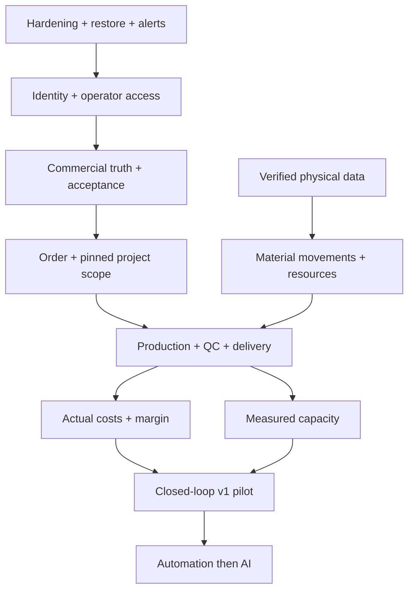

# Avitus Materia OS — System reconciliation

Date: 2026-09-28. Baseline: `68ea54441881c978eb6f18e8d4ae354689c1bf55` (main).
Scope: repository source, migrations 0000–0009, workflow definitions/results, read-only production HTTP probes, five named Drive workbooks and Physical Truth folder. This is an evidence-based baseline, not certification of every path. No production customer records were created or changed. No private Drive content is copied into this public repository.

## A. Executive audit summary

The system is a deployed sales foundation, not yet an operational OS v1. A later live browser check also found `/kreator` serving ConfiguratorLite (demo controls, no configuration submission), despite HTTP 200. The catalog-driven customer journey is therefore not production verified. Sprint 9 already implements Quote acceptance and atomic Order + Project creation. PROJECT_STATE, NEXT_ACTION, WORK_BOARD and README lag behind code. API deployment success must not be confused with an authenticated operational journey: production rejects internal requests because the external identity adapter is absent. The admin still uses development headers, and has no acceptance/order/project controls.

Physical Truth sources are preparation templates with unverified catalog candidates, not a measured workshop inventory. Actual cost, production, QC and delivery are still absent from executable code. AI pricing/capacity recommendations would currently lack a valid data foundation.

Immediate priorities: protect current public intake and PII, establish recovery/alert evidence, then production identity/operator access. Do not continue directly to capacity or AI. No evidence of an exploited vulnerability was obtained; unresolved P0 risks are release gates, not claims of an incident.

### Evidence ledger

| ID | Observation | Source / limits |
|---|---|---|
| E1 | Main contains Sprint 9 | `68ea544`; PR [28](https://github.com/dudsi101-svg/Avitus-Materia-OS/pull/28); earlier merged PRs 27, 26, 23 reviewed |
| E2 | Main CI succeeded | [36449482063](https://github.com/dudsi101-svg/Avitus-Materia-OS/actions/runs/36449482063), CI #136; PostgreSQL-backed CI runs migrate, seed, lint, typecheck, tests, build |
| E3 | API deploy succeeded | [36449743352](https://github.com/dudsi101-svg/Avitus-Materia-OS/actions/runs/36449743352), deploy #78 attempt 2; API deploy and readiness passed, web skipped |
| E4 | Live read-only probes | 18:15 UTC: `https://api.avitus-materia.com/ready` 200; `/leads` 401 with external adapter absent; `https://avitus-materia.com/kreator` 200. TLS validation enabled. These are point-in-time probes, not uptime evidence |
| E5 | Auth fails closed | `packages/config/src/index.ts`, `apps/api/src/request-context.ts`, `fly.api.toml`; development mode forbidden in production; external mode always rejects internal routes |
| E6 | Sales/acceptance implementation | `modules/{acquisition,customers,crm,configurator,pricing,quotes}/src/index.ts`, `apps/api/src/order-flow.ts`, migration 0009 and `order-flow.e2e.test.ts` |
| E7 | Data sources read | Physical Truth Master; Szybki zapis z hali; Karta produktu i procesu; KUBA — szybka weryfikacja realizacji; TOP MEBLE – Inwentaryzacja i migracja stolarni; folder 20_PHYSICAL_TRUTH_OS. Read-only; metadata modified Sep 26–27, content inspected Sep 28 |
| E8 | Dependency audit | `pnpm audit --prod --json`: 0 critical, 3 high, 2 moderate advisories. Scanner results need reachability triage; not proof of exploitation |
| E10 | Browser observation | Live `/kreator` rendered `Ustalmy punkt startowy`, fixed select/slider fields and `wersja robocza`; no submission form. This matches ConfiguratorLite. `loadConfiguratorProducts` silently returns null on missing env, upstream error or timeout; an empty catalog also activates fallback. Exact production cause remains unknown |
| E9 | Collaboration | No open PRs and no open issues returned at reconciliation start. Work board Sprint 9 claim is stale, not a live conflicting lane |

Migration 0009 is present and the release command runs migration + production bootstrap; E3 supports deployed schema, but the production migration ledger was not directly queried. Runtime SHA attestation is absent. No Fly control-plane backup, restore, secret or alert configuration was accessible in this audit. Absence of evidence is marked BLOCKED rather than invented success.

## SYSTEM BASELINE

Status is per capability, not per whole module. DEPLOYED is not PRODUCTION VERIFIED for business behavior. PLANNED/DESIGNED do not imply working code.

| Domain | Capability | Status | Evidence | Risk | Missing | Priority | Next action |
|---|---|---|---|---|---|---|---|
| Web | Public site/configurator reachability | PRODUCTION VERIFIED | E4; apps/web | Browser confirms demo fallback, not working intake | Catalog connectivity/runtime verification; mobile/a11y review | P2 | Browser acceptance after identity |
| Acquisition | Inquiry/configuration intake | PARTIAL | E2/E3; controllers + proxies + E2E | Public abuse | Edge/per-client controls, size bounds, idempotency | P0 | PR30 adds tested durable budget and safe proxy handling; verify remaining ingress protections |
| CRM | Lead/Opportunity/customer linking | DEPLOYED | E6; migrations 0001/0004/0007 | Operator cannot use in prod | Authenticated surface | P1 | Gate 2 |
| Identity | Production user login/session | BLOCKED | E4/E5 | No usable internal access | IdP integration/provisioning/session model | P1 | Select/configure approved identity tenant |
| IAM | Permission/membership foundation | IMPLEMENTED | modules/iam; seed-dev | Cross-org role assignment not DB constrained | Role matrix; role/org constraint; permission tests | P0 | Validate before enabling internal login |
| Configuration | Versioned catalog configuration | DEPLOYED | E6; migration 0001 | Reference drift downstream | Explicit production version binding | P1 | Gate 4/5 invariant tests |
| Pricing | Fixed-scale estimate arithmetic | TESTED | pricing tests; E2 | Estimates not actual cost | Verified rates/components | P1 | Calibrate against measured jobs |
| Quotes | Buyer/tax/discount/READY/SENT | DEPLOYED | PR27; migrations 0008; tests | SENT is a status, not email delivery | PDF, sending/evidence, viewed/rejected/expired/revisions | P1 | Gate 3 completion |
| Acceptance | SENT version accepted by operator | DEPLOYED | E6; PR28 | No customer acceptance proof UX | Permission/tenant/failure/concurrency coverage | P1 | Expand tests + operator/customer evidence |
| Order | One accepted quote -> order snapshot | DEPLOYED | E6; 0009 unique indexes/UoW | DB tenant FKs incomplete | Items, payments, lifecycle/delivery snapshots | P1 | Gate 4 completion |
| Project | Separate planning aggregate | DEPLOYED | E6; 0009 | Only minimal shell | Tasks, approvals, changes, documents, owner UX | P1 | Gate 5 |
| Admin | Production authenticated workspace | BLOCKED | apps/admin; E5 | Development-only headers | Login, deployment, order/project UI | P1 | Gate 2 |
| Physical truth | Structured source preparation | PARTIAL | E7 | Placeholders mistaken for facts | Measured/verified records, ownership, crosswalk | P1 | Staging import and validation |
| Material | Stock/lots/movements/reservations | DESIGNED | DOMAIN_MODEL; no implementation module | No material traceability | Entire operational slice | P1 | Gate 6 |
| Production | Jobs/operations/time/waste/QC | DESIGNED | DOMAIN_RULES; no implementation module | No plan vs actual | Entire operational slice | P1 | Gate 7 |
| Capacity | Resource calendar/workload | DESIGNED | docs; E7 | False delivery promises | Actual resources/durations/availability | P1 | Gate 8 after measurements |
| Delivery | Delivery/install confirmation | PLANNED | roadmap; no implementation | Loop cannot close | Proof/status/cost linkage | P1 | Add v1 delivery slice |
| Finance | Actual costs/contribution/margin | DESIGNED | docs; pricing only estimates | Margin mistaken for realized | Actual-cost ledger and reconciliation | P1 | Gate 9 |
| Events | Transactional outbox persistence | IMPLEMENTED | modules/events; 0000 | Events accumulate | Worker/retries/DLQ/consumer dedupe | P2 | Gate 10 |
| Observability | Correlation ID + health/readiness | PRODUCTION VERIFIED | E4; middleware | Failures invisible between probes | Alerts, structured request logs, error sink | P0 | Gate 1 |
| Recovery | Backup/restore proof | BLOCKED | No control-plane proof | Data-loss recovery unknown | Backup inventory, isolated restore drill | P0 | Obtain Fly recovery evidence |
| Privacy | PII-safe HTTP exception logging | DEPLOYED | PR29 + CI + API release 36465461468 | Other log paths need separate review | Broader privacy lifecycle | P0 slice closed | Retain regression tests; verify all logging surfaces |
| GDPR | Retention/export/erasure/legal basis | DESIGNED | DOMAIN_RULES; no implemented lifecycle | PII kept without operational lifecycle | Owner legal policy + implementation | P0 | Before real customer rollout |
| AI | Controlled context/actions | DESIGNED | policy docs | No trustworthy operational history | Context access controls + evaluation | P3 | Gate 11 after closed loop |
| Partners | Manufacturing network | DESIGNED | docs only | Premature platform work | Validated business demand | P4 | Gate 12 |

## B. Architecture health report

Keep the modular monolith. Positive evidence: explicit services/repositories; UnitOfWork; versioned configurations/quotes; exact four-decimal amounts; UTC timestamps; scoped repositories; audit and outbox in transactions. CustomerAccount is correctly separate from User. Order is separate from Project. No reason to introduce microservices.

Weak points:
- Order/Project domain, persistence and orchestration are concentrated in `apps/api/src/order-flow.ts`; expected domain modules do not exist yet. Extract incrementally when extending production; do not rewrite the stable sales core.
- Tenant isolation is mainly application-enforced. Migration 0004 uses composite tenant FKs, while many older tables and 0009 use single-ID FKs. No RLS policies found in migrations. A valid FK can still point across organizations if a writer violates service invariants.
- Role membership joins roles by ID without verifying that role.organization_id matches membership.organization_id (global roles require explicit handling). Treat as a gate before enabling production auth, not proof of remote privilege escalation today.
- Quote/version linkage is enforced in services, but acceptance/order lack composite version FKs. Project stores configuration_id only; operational readers must resolve the accepted version through Order -> accepted QuoteVersion, never current configuration. Add an explicit immutable execution baseline before production work.
- SQL history is append-oriented by convention, not immutable at DB privilege level. Organization cascades can delete business/audit history. No erasure API was found, but recovery/retention must define this deliberately.
- Migration runner uses transactions per file, but no checksum/advisory lock. Applied migrations are forward-only, not universally reversible. Enum/data compatibility must be considered in rollback.
- Appropriate scoped indexes exist; no measured load profile was available, so performance claims remain unverified.

## C. Product / business process gap analysis

| Step | Executable today | Outside OS / missing |
|---|---|---|
| Lead -> Customer | Intake, conversion, explicit identity linking | Operator production access |
| Configuration -> Pricing | Catalog and deterministic manual component pricing | Verified workshop costs, approved commercial pricing data |
| Quote | Snapshots/governance/status | PDF, dispatch, communication history; SENT does not prove receipt |
| Acceptance -> Order | API and database orchestration | Operator UI; customer acceptance evidence; full order items/payment/delivery data |
| Order -> Project | Planning record | Tasks, drawings, decisions, change requests and execution baseline |
| Material -> Production -> QC | Design documents | Stock, reservations, jobs, time, waste, rework and checks |
| Delivery -> Payment -> Actual cost | No closed operational slice | Delivery evidence, payment reconciliation, actual cost allocation, contribution |

No end-to-end test currently proves the full user-requested journey. `order-flow.e2e.test.ts` is one happy-path API integration test with sequential replay, audit/events and immutable revision check. It is not a browser test or concurrent/tenant/permission/failure-path suite. Earlier sales modules have broader negative/tenant tests; do not extrapolate that coverage to Sprint 9.

Frontend source offers catalog-driven options, loading/error messages and development Command Center controls. A read-only live browser check instead observed the ConfiguratorLite fallback without submission, so current production catalog intake is not verified. Production mobile/a11y/keyboard behavior was not exercised here. Network exceptions/timeouts in public Next proxies are not handled explicitly; duplicate clicks can create separate intake records. Acceptance/order/project controls were not found in admin.

## D. Security & production readiness

Current defenses: production dev-auth ban; fail-closed internal guard; constant-time public shared-key comparison; server-side organization selection; bounded Zod inputs/honeypot; scoped services; audit PII minimization. CORS is origin-limited but is not authentication or abuse protection.

Threats requiring action:
- Internet -> web proxy -> public write API: no rate limiter found, no idempotency; honeypot alone is insufficient. Determine edge/WAF coverage from provider rather than assuming it exists. Limit at ingress and enforce server budget; do not trust arbitrary forwarded IP headers.
- API failure -> logs: raw exception includes potential SQL bind parameters/cause/PII. Replace with strict allowlist and correlated failure event first.
- Membership -> role -> permissions: constrain role tenant and test cross-org assignment before real login.
- DB write -> cross-tenant references/history destruction: strengthen composite FK/privileges before broad production writes. App tests alone do not establish DB enforcement.
- CSRF/session threat model remains pending because no production session implementation exists. Configure SameSite/secure cookies, CSRF/origin checks as appropriate to chosen session boundary; test XSS/token handling in that implementation.
- Headers: live API advertises Express and lacks visible nosniff/frame/CSP headers; web source sets poweredByHeader false but no security headers policy. Add a tested CSP compatible with Next rather than copying a breaking template.
- Secrets: no secret values were requested or printed. Fly workflow uses GitHub secret; server public credential stays off browser. Secret rotation/inventory and historical secret scan were not completed.
- Dependency audit: Drizzle GHSA-gpj5-g38j-94v9 (high; installed 0.44.x, patched >=0.45.2) and four PostCSS advisories (2 high + 2 moderate). User-controlled SQL identifiers/CSS source maps were not proven reachable. Patch in a separate compatibility-tested slice; scanner severity is not an exploit assessment.
- Backup/PITR and external alert routing are unknown, not verified. `/ready` tests SELECT 1, not schema version or successful commercial execution.

First patch scope: API HTTP error logging only, no migrations and no API contract changes. Gate 1 remains open until actual alert and restore tests pass. Bootstrap/migration process logging requires a subsequent scrub review; this patch does not claim all logs are safe.

## E. Data / Physical Truth readiness

Five requested workbooks and the named folder were inspected read-only. Observations:
- Master: 7 realization candidates all awaiting verification; 7 product drafts; 11 named operation templates without measured durations/resource mapping.
- Machine/workstation/material/time/waste rows include placeholders. Placeholder `AVAILABLE` is not proof that material exists. No completed measured time/cost dataset was found in these sources.
- Quick hall log and product/process card are blank templates, not completed transactions.
- KUBA verification: seven unchecked entries and publication decisions awaiting review. This does not establish whether separate publication permission exists elsewhere. Confirm before adding/reusing further media.
- TOP MEBLE: actual inventory/WIP registers are blank. Checklist rows and dashboard counts must not be counted as physical assets.
- ID conventions conflict: MCH vs MAS for machines, MAT widths differ, workstations and physical zones must remain separate. Use `(organization, source, external_id)` aliases mapped to internal UUIDs; do not overwrite source IDs.
- Units differ: master dimensions in mm, public catalog includes cm. Staging requires explicit units/conversion; reject ambiguous units rather than guessing.

| Data class | Examples | Migration rule |
|---|---|---|
| Master | Products, operations, machines, locations | Verified stable identities; placeholders quarantined |
| Transaction | Jobs, material movements, reservations | Link to tenant + job + real occurrence; idempotent source keys |
| Measurement | Start/stop, waste quantity, moisture | Units, measured_at, recorded_at, recorder and provenance |
| History | Realizations, corrections, acceptance | Preserve source/version; append corrections |
| Derived | Availability, cost totals, margin | Recompute from validated inputs; do not import dashboard formulas as facts |

Staging acceptance: dry-run report; owner/recorder per source; duplicate/cross-source-ID report; required fields; referential integrity; unit validation; quarantine examples/placeholders; checksum/source-version provenance; replay creates no duplicates; no automatic customer merge. First useful pilot: one actual job measured from material issue to QC/delivery/cost. Source collection may proceed while software hardening runs.

AI readiness: text drafting with human review is feasible with approved inputs. Historical cost recommendation, margin anomaly detection and capacity prediction are BLOCKED by missing measurements. No autonomous price/date commitment.

## F. Technical debt register

| ID | Debt | Consequence | Priority | Smallest repair |
|---|---|---|---|---|
| TD1 | Stale state/readme/board | Agents repeat delivered work | P1 | Reconcile to exact evidence |
| TD2 | Domain logic/persistence in API root | Coupling grows | P2 | Extract Order/Project on next domain extension |
| TD3 | Inconsistent tenant FKs/role scope | Integrity bypass possible by writer bug | P0 gate | Preflight orphan/cross-tenant queries + additive constraints |
| TD4 | No migration checksum/lock | Concurrent releases/drift | P1 | Advisory lock + checksums with legacy baseline |
| TD5 | Narrow Sprint 9 tests | False confidence in critical path | P1 | Tenant, permission, race, rollback and rejection tests |
| TD6 | Deployment target regex omits packages/shared | Shared-only change may not deploy API | P1 | Dependency-aware target test and fix |
| TD7 | Outbox write-only | Automation cannot deliver | P2 | Small publisher with dedupe/retry/DLQ |
| TD8 | No runtime commit/schema attestation | Deployment trace weak | P2 | Build revision + safe schema readiness |
| TD9 | Proxy timeout/catch addressed by PR30; idempotency remains open | Ambiguous successful writes may be resubmitted | P1 partial | Preserve no automatic retry; add durable idempotency contract |
| TD10 | Dependency advisories | Avoidable supply-chain exposure | P1 pending reachability | Patch supported versions and CI |

## G. Risk register P0–P4

| ID | Priority | Risk / evidence | Owner | Closure proof |
|---|---|---|---|---|
| R01 | P0 — closed for HTTP filter | Raw exception serialization removed by PR29 | Engineering | 3 regression tests, main CI and API deployment 36465461468 |
| R02 | P0 — PARTIAL | PR30 bounds writes with a durable org budget; edge/per-client/size protections still unverified | Engineering | DB concurrency, HTTP 429 and proxy timeout tests passed; complete ingress protections and alert evidence |
| R03 | P0 | Backup recovery unverified (control-plane access absent) | Operations/owner | Isolated restore, integrity checks, measured RPO/RTO |
| R04 | P0 | No verified alerting: outage may be reported by customer | Operations | Deliberate staging fault produces alert to approved destination |
| R05 | P0 before auth rollout | Role tenant and relational isolation incomplete | Engineering | Cross-tenant writes denied by constraints/permissions and tests |
| R06 | P0 before live customer rollout | PII retention/legal policy unresolved | Owner + engineering | Approved policy, implemented retention/export/erasure/legal hold |
| R07 | P1 | Production operator auth absent | Owner configuration + engineering | Real login/session/RBAC/negative tests + browser smoke |
| R08 | P1 | Minimal Order/Project cannot run job | Engineering | Items, pinned scope, task/approval/change history |
| R09 | P1 | Physical truth is unverified/mostly blank | Workshop data owner | Verified assets + measured job, reconciliation accepted |
| R10 | P1 | Production/delivery/actual cost absent | Engineering + workshop | Complete pilot E2E and reconciled contribution |
| R11 | P1 pending triage | 5 dependency advisories E8 | Engineering | Reachability assessment + patched lockfile/CI |
| R12 | P1 | Sprint 9 race/tenant/failure tests missing | Engineering | DB-backed negative + concurrent tests |
| R13 | P1 | Shared package changes may skip API deployment | Engineering | Deployment detection regression cases |
| R14 | P2 | No publisher/docs/communication delivery | Engineering | Outbox proof and delivery audit |
| R15 | P3 | AI over sparse/unapproved data | Product | Evaluation set + context permissions after v1 |
| R17 | P1 | Live configurator silently falls back to a demo; 200 health hides broken journey (E10) | Engineering/operations | Verify runtime catalog connectivity/credential configuration without exposing values, restore catalog UI, add business-capability probe |
| R16 | P4 | Premature network/platform | Owner | Demonstrated own-workshop loop + partner pilot need |

P0 classification is complete for the inspected surface; findings may expand with control-plane and authenticated testing. No claim that all vulnerabilities have been discovered.

## H. Dependency map

## I. Revised implementation sequence

User master program takes precedence over earlier F1.5 AI/visualization sequencing. Gate 1/2 before expanding operator features. Gates 3–5 complete existing slices, not rebuild them. Physical capture precedes capacity prediction. Basic capacity truth may be recorded with jobs, but scheduling recommendations wait for measurements. Delivery is an explicit v1 slice between production and actual-cost closure. Full automation/AI/partners follow a validated manual-in-OS loop.

## J. Sprint / gate plan to v1

These are gate work packages, not reserved sequential sprint numbers.

| Gate | Small vertical deliverable | Exit evidence |
|---|---|---|
| 1a | Safe errors + correlated failure stream | Regression tests, CI, deployed code |
| 1b | Intake budgets/headers/proxy failure handling | Abuse/failure tests and production configuration proof |
| 1c | Backup/restore/alert/DR + privacy/secrets/dependencies | Isolated restore + alert drill; owner policy decisions recorded |
| 2 | IdP/login/session + membership/RBAC + admin deploy | Real allowed/denied users; tenant tests; browser journey |
| 3 | Quote dispatch/document/acceptance evidence/lifecycle | Exact version sent and accepted, expired/rejected paths |
| 4 | Order items/pinned commercial + payment/delivery facts | No recomputation of accepted history; retry/race tests |
| 5 | Project tasks/files/approvals/change requests | One executable job scope, owner and dependency tracking |
| 6 | Physical staging/master + movements/reservations | Dry-run/replay proof; verified real materials/resources |
| 7 | Job/operations/time/waste/issues/QC | Plan vs actual with rejection/rework and audit |
| 8 | Calendar/resources/workload | Availability known; recommendations only with evidence |
| v1 delivery | Dispatch/install/receipt and actual transport cost | Delivery evidence and authorized status transition |
| 9 | Actual cost ledger + contribution | Material/labor/machine/outsourcing/transport/packaging/waste/rework/warranty; no double count; quoted vs actual |
| v1 proof | Real order from acquisition to contribution | All steps in OS; no parallel uncontrolled source; production verification and owner operational acceptance |
| 10–12 | Publisher -> AI context -> partner pilot | Idempotent audited automation first; AI controlled; partner need validated |

Every package includes schema if needed -> domain -> API -> UI -> tests -> deployment -> smoke -> docs. No package is DONE solely because this plan exists. Payment/legal terms and cost allocation policy require owner approval when material, rather than invented defaults.

## K. First ten concrete actions

1. Reconcile state/board/README/roadmap to E1–E9 and commit this baseline.
2. Replace raw HTTP exception logging with allowlisted JSON; test nested SQL/PII redaction and 503 signal; deploy through CI.
3. Diagnose live ConfiguratorLite fallback (E10), restore catalog-backed UI and business smoke; fix deploy target coverage for packages/shared with regression cases.
4. Triage/pin patched Drizzle/PostCSS dependencies, run full CI and migration/quote regression.
5. Add public ingress/write budgets plus proxy timeout/retry/idempotency behavior, preserving org trust boundary.
6. Verify Fly backup/PITR inventory and restore into an isolated database; measure RPO/RTO and retain sanitized evidence.
7. Configure error/uptime alert destination and conduct controlled fault drill; no unapproved messages to third parties.
8. Add tenant role/FK invariants and Sprint 9 permission/tenant/race/rollback tests before exposing admin.
9. Integrate production identity and deploy operator UI including acceptance/order/project actions; prove browser journey.
10. Stage Physical Truth with source aliases/units/verification statuses, then implement one measured job through QC/delivery/actual cost.

## Owner input / access dependencies

Not needed for this first reversible patch. Later: production identity tenant/app registration and credentials; Fly recovery/alert configuration access; approved alert recipients; actual workshop records/recorder; legal retention and commercial acceptance/payment policy. Never send secret values in chat or commit them. These dependencies do not block code review, safe fixes, tests or documentation.

## Post-baseline implementation evidence

PR #29 merged as `d43bb53351731bce3cc9482dcdb55698c8219c75`. PR CI 36464939159 and main CI 36465241308 passed (including PostgreSQL migration/seed/tests/build). API deploy [36465461468](https://github.com/dudsi101-svg/Avitus-Materia-OS/actions/runs/36465461468) succeeded at 18:31 UTC; readiness passed and deployed-api tag matches the merge. R01 is remediated for the HTTP filter scope: raw exceptions are not serialized; 3 regression tests cover private SQL/cause data, arbitrary thrown values and 503/400 behavior. Other P0s remain open. No live production 500 was deliberately induced; do not interpret this as a full telemetry/alert drill.

R17 was found during additional read-only browser verification: current page is a demo fallback with no submission form. This overrides older documentation claiming a functioning production configurator journey. Resolve runtime catalog/deployment configuration before treating acquisition E2E as production verified. Direct DNS queries were unavailable from the execution resolver; successful HTTPS probes/browser loading establish reachability, not an authoritative DNS-zone audit. No DNS/mail records changed.

## Reconciliation addendum — 2026-09-29 deployment trust

| ID | Priority | Finding | Evidence | Status / next action |
|---|---|---|---|---|
| R18 | P0 | Privileged workflow_run deploy admitted successful PR heads named main | deploy-fly.yml at 04f697d; predicate regression fails before fix | PR31 merged 7f94a65; ten regression scenarios + PR/main CI passed; workflow 36534332017 starts for trusted main push. R18 predicate fixed; no exploit attempted |

This finding supersedes any assumption that successful CI plus branch name alone establishes deployment provenance. No evidence of exploitation was collected.

## Verified hardening checkpoint — 2026-09-29 12:02 UTC

| Capability | Status | Evidence | Remaining risk / action |
|---|---|---|---|
| Shared durable public intake budget; safe web timeout/429 | DEPLOYED | PR30, migration 0010, real PostgreSQL concurrency + HTTP CI; API deploy 36565136322, tag d3a8de6; web tag 04f697d | R02 PARTIAL: edge/per-client/size/idempotency; live rate-load test not performed |
| Privileged deployment provenance | TESTED / active on main | PR31; ten predicate cases; trusted push deployments | R18 predicate fixed; broader action/token hardening separate |
| Bounded read-only database preflight | PRODUCTION VERIFIED | PR32/33; run 36565136322: org present, 2 products, no visible lock waits | Point-in-time, role-limited visibility; not monitoring or restore proof |
| API release recovery | DEPLOYED | Successful release 36565136322 after two bootstrap failures | R19 P1: original connection termination root cause unknown; retain evidence and correlate provider logs if recurrence |

This checkpoint supersedes previous BLOCKED API rollout notes, without erasing the incident history. No database reset, credential/provider change or session termination was used.
